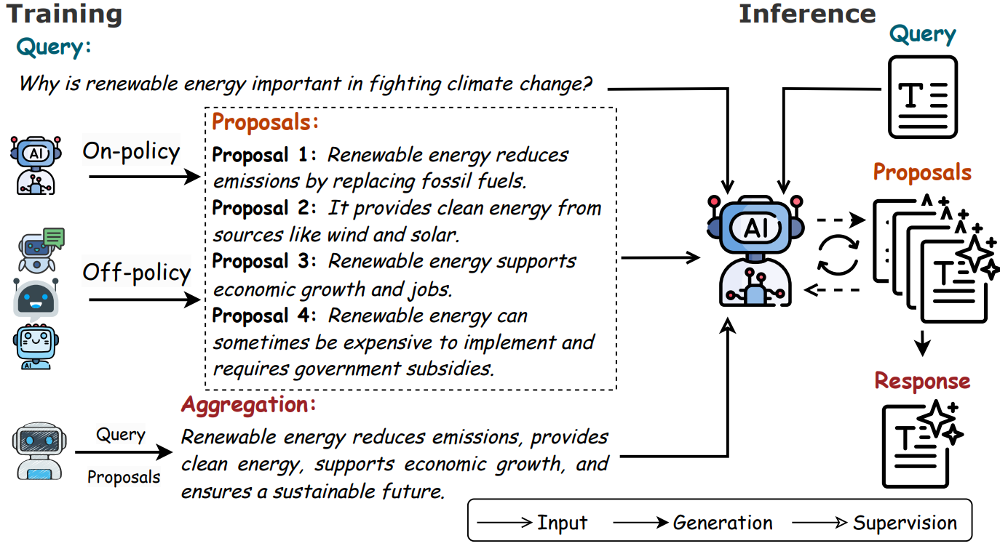

# From Drafts to Answers: Unlocking LLM Potential via Aggregation Fine-Tuning

<div align="center">
  <a href="https://github.com/Linzwcs/AFT/tree/main"></a> &ensp;
  <a href=""></a> &ensp;
  <a href="https://huggingface.co/GuanjieChen/Skip-DiT"></a> &ensp;
</div>

<div align="center">
  </img>
  <br>
  <em>
      (Framework of aggregation fine-tuning and propose-and-aggregate inference.) 
  </em>
</div>
<br>


This repository contains the official PyTorch implementation of the paper: **[From Drafts to Answers: Unlocking LLM Potential via Aggregation Fine-Tuning](https://arxiv.org/abs/2501.11877)**. 
In this work, we introduce Aggregation Fine-Tuning (**AFT**), a supervised fine-tuning paradigm where the model learns to synthesize multiple draft responses, referred to as prposals, into a single, refined answer, termed aggregation. 
An AFT model, fine-tuned from **Llama3.1-8B-Base** with only **64K** data, achieves a **41.3\%** LC win rate on AlpacaEval 2, surpassing significantly larger LLMs such as **Llama3.1-405B-Instruct** and GPT-4.


## 🔔 News
- **[22/01/2025]** Our paper is released on arXiv: [https://arxiv.org/abs/2501.11877](https://arxiv.org/abs/2501.11877).
- **[20/01/2025]** Our code and models are open-sourced!


## 🚀 Quick Start

###  Install


To install the inference framework, follow the steps below:

1. **Create and activate a new environment:**
   ```bash
   conda create -n AFT python=3.11
   conda activate AFT
   ```

2. **Install PyTorch based on your device configuration:**

   Our device uses CUDA 12.1, so install PyTorch with the following command:
   ```bash
   pip3 install torch torchvision torchaudio --index-url https://download.pytorch.org/whl/cu121 
   ```

3. **Clone the repository, navigate to the directory, and install our inference framework:**
   ```bash
   git clone git@github.com:Linzwcs/AFT.git
   cd AFT
   pip install -e .
   ```

### Inference

We provide a sample inference code for `propose-and-aggregate` in inference.py. You can execute it by running the following command:

```bash
  python inference.py \
        --config ./configs/default.yaml \
        --input_file ./data/sample.jsonl \
        --output_file ./output/output.jsonl \
        --batch_size 16
```

The detailed meanings of the keys in the config file are illustrated below：

```yaml
  model_name: <path to AFT model> # path to AFT model 
  
  # The proposal_params and aggregation_params are instances of SamplingParams 
  # and will be sent to vllm.chat().
  generation_params:
    temperature: 0.7
    top_p: 0.95
    max_tokens: 4096
    n: 5  # number of propsals per step
    final_layer_temperature: 0.7
    final_layer_top_p: 1

  vllm_seed: 2024 # vllm backend seed


  num_aggregation: 2  # Number of aggregation layers
```

## Datasets
We consider two types of training datasets, differing in the proposal type, i.e., off-policy proposals and on-policy proposals.
*Off-policy* proposals are derived from existing preference alignment datasets, such as [UltraFeedback](https://github.com/OpenBMB/UltraFeedback), where each query is accompanied by multiple responses generated by models different from the one being fine-tuned.
*On-policy* proposals are obtained by leveraging in-context learning (ICL) with demonstrations, prompting the base LLM to generate multiple responses for a given query.
These two types of base models, combined with the two datasets, form our four AFT models.

**Datasets to be Released**:

  1. `Linzwcs/AFT-off-policy`
  2. `Linzwcs/AFT-on-policy-llama`
  3. `Linzwcs/AFT-on-policy-mistral`

> *Our datasets will be released soon.*


## Models
We build our models based on two model families: the [Llama-3.1-8B](https://huggingface.co/meta-llama/Llama-3.1-8B/tree/main) and [Mistral-7B-v0.1](https://huggingface.co/mistralai/Mistral-7B-v0.1). 
We train the models on both on-policy and off-policy training data, yielding altogether four AFT models, as listed below:

**Released Models**:

  1. [`Linzwcs/Llama-AFT-Off-Policy`](https://huggingface.co/linzw/Llama-AFT-Off-Policy)
  2. [`Linzwcs/Llama-AFT-On-Policy`](https://huggingface.co/linzw/Llama-AFT-On-Policy)
  3. [`Linzwcs/Mistral-AFT-Off-Policy`](https://huggingface.co/linzw/Mistral-AFT-Off-Policy)
  4. [`Linzwcs/Mistral-AFT-On-Policy`](https://huggingface.co/linzw/Mistral-AFT-On-Policy)

You can use these models by setting the `model_name` in the configuration file to the corresponding model names. Please refer to our paper for training details.


## 🔍 Benchmark Performance
We evaluate our models on two benchmark datasets: MT-Bench and AlpacaEval 2, and the results are presented below:

<table border="1">
 <thead>
    <tr>
      <td></td>
      <td colspan="3" style="text-align: center;"><strong>MT-Bench</strong></td>
      <td colspan="2" style="text-align: center;"><strong>AlpacaEval</strong></td>
    </tr>
    <tr>
      <th><strong>Model</strong></th>
      <th><strong>1st turn</strong></th>
      <th><strong>2nd turn</strong></th>
      <th><strong>Avg.</strong></th>
      <th><strong> LC(%)</strong></th>
      <th><strong>WR(%)</strong></th>
    </tr>
  </thead>
  <tbody>
    <tr>
     <td colspan="6" style="text-align: center;"><strong>Mistral-7B-v0.1-Base</strong></td>
  </tr>
    <tr>
      <td>SFT</td>
      <td>6.6</td>
      <td>6.1</td>
      <td>6.4</td>
      <td>6.7</td>
      <td>6.1</td>
    </tr>
    <tr>
      <td>AFT-off-policy</td>
      <td>7.7</td>
      <td>6.3</td>
      <td>7.0</td>
      <td>19.8</td>
      <td>20.0</td>
    </tr>
    <tr>
      <td>w/ Agg.</td>
      <td>8.0</td>
      <td>7.0</td>
      <td>7.5</td>
      <td><strong>33.8</strong></td>
      <td>47.8</td>
    </tr>
    <tr>
      <td>AFT-on-policy</td>
      <td>7.5</td>
      <td>6.4</td>
      <td>6.9</td>
      <td>23.4</td>
      <td>24.9</td>
    </tr>
    <tr>
      <td>w/ Agg.</td>
      <td><strong>8.3</strong></td>
      <td><strong>7.0</strong></td>
      <td><strong>7.6</strong></td>
      <td>30.7</td>
      <td><strong>48.4</strong></td>
    </tr>
    <tr>
      <td colspan="6" style="text-align: center;"><strong>Llama3.1-8B-Base</strong></td>
   </tr>
    <tr>
      <td>SFT</td>
      <td>7.3</td>
      <td>6.2</td>
      <td>6.8</td>
      <td>8.0</td>
      <td>7.3</td>
    </tr>
    <tr>
      <td>AFT-off-policy</td>
      <td>7.7</td>
      <td>6.9</td>
      <td>7.3</td>
      <td>20.3</td>
      <td>19.6</td>
    </tr>
    <tr>
      <td>w/ Agg.</td>
      <td>8.3</td>
      <td><strong>7.6</strong></td>
      <td>7.9</td>
      <td>40.3</td>
      <td>47.8</td>
    </tr>
    <tr>
      <td>AFT-on-policy</td>
      <td>7.9</td>
      <td>6.9</td>
      <td>7.4</td>
      <td>21.5</td>
      <td>21.8</td>
    </tr>
    <tr>
      <td>w/ Agg.</td>
      <td><strong>8.5</strong></td>
      <td><strong>7.6</strong></td>
      <td><strong>8.1</strong></td>
      <td><strong>41.3</strong></td>
      <td><strong>51.3</strong></td>
    </tr>
  </tbody>
</table>


      
## Acknowledgement
This project is mainly motivated and supported by several existing works:

1. [Mixture-of-Agents Enhances Large Language Model Capabilities](https://arxiv.org/abs/2406.04692): we draw inspiration from MoA to propose aggregation leanring.

2. [vLLM](https://github.com/vllm-project/vllm): we construct the generation pipeline based on vLLM. 

## 📝 Citation

```
@misc{li2025draftsanswersunlockingllm,
      title={From Drafts to Answers: Unlocking LLM Potential via Aggregation Fine-Tuning}, 
      author={Yafu Li and Zhilin Wang and Tingchen Fu and Ganqu Cui and Sen Yang and Yu Cheng},
      year={2025},
      eprint={2501.11877},
      archivePrefix={arXiv},
      primaryClass={cs.CL},
      url={https://arxiv.org/abs/2501.11877}, 
}
```

## License
The code and model weights are licensed under [LICENSE](./LICENSE).

